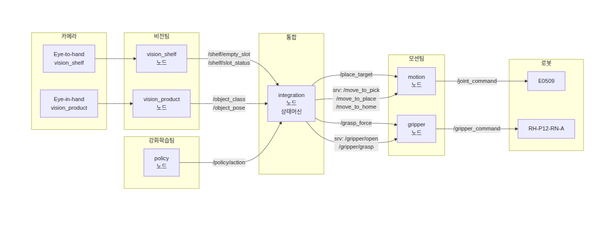

# smart-shelf-robot 기능명세서

---

## 1. 시스템 개요

| 항목 | 내용 |
|------|------|
| 프로젝트명 | smart-shelf-robot |
| 목적 | 상품을 감지하고 물성에 맞는 전류로 매대에 자동 정리 |
| 로봇 | Doosan E0509 + RH-P12-RN-A 그리퍼 |
| 카메라 | RealSense D455f x1 (Eye-in-hand) |
| 모션 플래닝 | cuRobo (motion 노드에 통합) |
| 파지 자세 | Isaac Sim 시뮬레이션 결과 → grasp_pose_sim.yaml 정적 활용 |
| 환경 | Ubuntu 22.04 + ROS2 Humble |

---

## 2. 노드 관계도

---

## 3. 노드별 기능명세

### 3-1. vision 노드

| 항목 | 내용 |
|------|------|
| 담당 | 비전팀 (남상훈, 이현호) |
| 카메라 | Eye-in-hand (로봇 손목) |
| 입력 | `/camera/color/image_raw`, `/camera/depth/image_rect_raw` |
| 출력 | `/shelf/empty_slot`, `/shelf/slot_status`, `/object_class`, `/object_pose` |

| 기능 ID | 기능명 | 설명 | 동작 시점 |
|---------|--------|------|----------|
| VS-01 | 매대 슬롯 감지 | 매대 4개 슬롯 상품 존재 여부 감지 | SHELF_DETECTING |
| VS-02 | 빈 슬롯 발행 | 빈 슬롯 번호 + 필요 클래스 발행 (예: "1,can") | SHELF_DETECTING |
| VS-03 | 전체 상태 발행 | 전체 슬롯 상태 주기적 발행 | SHELF_DETECTING |
| VS-04 | 상품 검출 | 상품 구역에서 해당 클래스 YOLO 검출 | PRODUCT_DETECTING |
| VS-05 | 3D 포즈 추정 | depth + 카메라 내부 파라미터로 상품 3D 좌표 계산 | PRODUCT_DETECTING |
| VS-06 | 좌표계 변환 | 카메라 좌표 → 로봇 base_link 좌표계 변환 (TF) | PRODUCT_DETECTING |
| VS-07 | 미검출 처리 | 해당 클래스 미검출 시 integration 노드에 알림 | PRODUCT_DETECTING |

**슬롯-클래스 매핑 (place_targets.yaml 기준)**

| 슬롯 번호 | 상품 클래스 |
|----------|-----------|
| 1 | can |
| 2 | bottle |
| 3 | snack |
| 4 | bread |

---

### 3-2. integration 노드

| 항목 | 내용 |
|------|------|
| 담당 | 심예영 |
| 입력 | `/shelf/empty_slot`, `/object_class`, `/object_pose` |
| 출력 | `/place_target` |
| 참조 파일 | `config/grasp_pose_sim.yaml`, `config/place_targets.yaml`, `config/grasp_force_params.yaml` |
| 서비스 클라이언트 | `/move_to_shelf_view`, `/move_to_product_view`, `/move_to_pick`, `/move_to_place`, `/move_to_home`, `/gripper/open` |
| 액션 클라이언트 | `/gripper/grasp` |

| 기능 ID | 기능명 | 설명 |
|---------|--------|------|
| IN-01 | 상태머신 관리 | IDLE → MOVE_TO_SHELF_VIEW → SHELF_DETECTING → MOVE_TO_PRODUCT_VIEW → PRODUCT_DETECTING → MOVING_PICK → GRASPING → MOVING_PLACE → PLACING → DONE 순서 제어 |
| IN-02 | 파지 자세 계산 | object_pose + grasp_pose_sim.yaml(물체 기준 좌표) → 월드 좌표계 파지 자세 계산 |
| IN-03 | 목표전류 결정 | 상품 클래스에 따라 목표전류 결정 후 /gripper/grasp 액션 goal로 전달 |
| IN-04 | 적재 위치 결정 | 빈 슬롯 번호에 따라 place_targets.yaml에서 좌표 조회 후 /place_target 발행 |
| IN-05 | 에러 처리 | 상품 미검출, 파지 실패, 이동 실패 시 안전 복귀 |
| IN-06 | 작업 루프 | DONE 후 IDLE로 복귀하여 다음 빈 슬롯 처리 반복 |

**상태머신 전이 조건**

| 현재 상태 | 전이 조건 | 다음 상태 |
|----------|----------|----------|
| IDLE | 시스템 시작 | MOVE_TO_SHELF_VIEW |
| MOVE_TO_SHELF_VIEW | 이동 완료 | SHELF_DETECTING |
| SHELF_DETECTING | 빈 슬롯 감지 | MOVE_TO_PRODUCT_VIEW |
| SHELF_DETECTING | 빈 슬롯 없음 | IDLE |
| MOVE_TO_PRODUCT_VIEW | 이동 완료 | PRODUCT_DETECTING |
| PRODUCT_DETECTING | 상품 검출 성공 | MOVING_PICK |
| PRODUCT_DETECTING | 상품 미검출 | MOVE_TO_SHELF_VIEW |
| MOVING_PICK | 이동 완료 | GRASPING |
| MOVING_PICK | 이동 실패 | ERROR |
| GRASPING | 파지 성공 | MOVING_PLACE |
| GRASPING | 파지 실패 | ERROR |
| MOVING_PLACE | 이동 완료 | PLACING |
| MOVING_PLACE | 이동 실패 | ERROR |
| PLACING | 적재 완료 | DONE |
| DONE | - | IDLE |
| ERROR | 안전 복귀 완료 | IDLE |

---

### 3-3. motion 노드

| 항목 | 내용 |
|------|------|
| 담당 | 김민성 |
| 입력 | `/place_target` |
| 출력 | `/joint_command` |
| 서비스 서버 | `/move_to_shelf_view`, `/move_to_product_view`, `/move_to_pick`, `/move_to_place`, `/move_to_home` |
| 모션 플래닝 | cuRobo (노드 내부 통합) |

| 기능 ID | 기능명 | 설명 |
|---------|--------|------|
| MO-01 | 매대 관찰 위치 이동 | /move_to_shelf_view 수신 시 홈(매대 정면) 포지션으로 이동 |
| MO-02 | 상품 구역 이동 | /move_to_product_view 수신 시 상품 구역 관찰 위치로 이동 |
| MO-03 | 파지 위치 이동 | /move_to_pick 수신 시 integration이 계산한 파지 자세로 이동 |
| MO-04 | 적재 위치 이동 | /move_to_place 수신 시 place_target 기반 경로 계획 및 이동 |
| MO-05 | 홈 복귀 | /move_to_home 수신 시 홈 포지션으로 이동 |
| MO-06 | cuRobo 경로 계획 | 충돌 회피 포함한 경로 계획 |
| MO-07 | 캘리브레이션 | Eye-in-hand 카메라 ↔ 로봇 좌표계 캘리브레이션 |

---

### 3-4. gripper 노드

| 항목 | 내용 |
|------|------|
| 담당 | 김민성 |
| 입력 | `/gripper/grasp` (액션 goal: 목표전류) |
| 출력 | `/gripper_command`, `/gripper/grasp` (액션 feedback: 진행전류) |
| 서비스 서버 | `/gripper/open` |
| 액션 서버 | `/gripper/grasp` |

| 기능 ID | 기능명 | 설명 |
|---------|--------|------|
| GR-01 | 그리퍼 열기 | /gripper/open 수신 시 그리퍼 완전 개방 |
| GR-02 | 전류 기반 파지 | /gripper/grasp 액션 수신 시 goal의 목표전류로 파지 |
| GR-03 | 전류 상한 제어 | 클래스별 최대전류 초과 방지 (bread: 150mA, snack: 300mA, bottle: 600mA, can: 1000mA) |
| GR-04 | 파지 피드백 | 파지 진행 중 현재 전류값 feedback으로 전송 |
| GR-05 | 파지 성공 판단 | 목표전류 도달 여부로 파지 성공 판단 후 result 반환 |

---

### 3-5. simulation 노드 (Isaac Sim, 오프라인)

| 항목 | 내용 |
|------|------|
| 담당 | 김인영, 남정혁 |
| 역할 | Isaac Sim에서 물체별 최적 파지 자세 시뮬레이션 후 결과를 yaml로 저장 |
| 출력 | `config/grasp_pose_sim.yaml` (정적 파일, 토픽 아님) |
| 실행 시점 | 배포 전 오프라인 실행 (실시간 통신 없음) |

| 기능 ID | 기능명 | 설명 |
|---------|--------|------|
| SIM-01 | 물체 모델 로드 | Isaac Sim에 물체 4종 USD 모델 로드 |
| SIM-02 | 파지 자세 탐색 | 물체 기준 좌표계에서 최적 파지 위치/자세 시뮬레이션 |
| SIM-03 | 결과 저장 | 시뮬레이션 결과를 grasp_pose_sim.yaml로 저장 |

---

## 4. 모션 포인트 정의

| 포인트 | 설명 | 관련 서비스 |
|--------|------|-----------|
| home / shelf_view | 매대 정면, SHELF_DETECTING 수행 위치 | `/move_to_shelf_view` |
| product_view | 상품 구역 위, PRODUCT_DETECTING 수행 위치 | `/move_to_product_view` |
| pick | 파지 자세 (object_pose + grasp_pose_sim.yaml → integration 계산) | `/move_to_pick` |
| place | 빈 슬롯 적재 위치 (place_targets.yaml) | `/move_to_place` |

---

## 5. 설정 파일 목록

| 파일 | 작성 주체 | 설명 |
|------|----------|------|
| `config/grasp_force_params.yaml` | 김민성 | 물체별 목표전류 파라미터 |
| `config/place_targets.yaml` | 김민성 | 매대 슬롯별 적재 위치 좌표 |
| `config/grasp_pose_sim.yaml` | 김인영, 남정혁 | Isaac Sim 기반 물체 기준 파지 자세 |

---

## 6. 물성별 파지 전략

| 클래스 | 목표전류 (mA) | 최대전류 (mA) | 전략 | 비고 |
|--------|-------------|-------------|------|------|
| bread | 100 | 150 | soft | 소프트바디, 변형 방지 |
| snack | 200 | 300 | edge | 봉지 끝단 파지 |
| bottle | 400 | 600 | cylinder | 원통형 형상 기반 |
| can | 800 | 1000 | max | 금속, 미끄럼 방지 |

---

## 7. 비기능 요구사항

| 항목 | 요구사항 |
|------|---------|
| 통신 | 전 노드 ROS_DOMAIN_ID=100, 동일 와이파이(ASUS_20) |
| 주기 | vision 10Hz, 상태머신 5Hz |
| 안전 | 에러 발생 시 그리퍼 즉시 개방 후 홈 복귀 |
| 배포 | 로봇 제어 코드만 레포 포함, 비전은 모델 파일만 업로드 |
| 인터페이스 | 모든 토픽/서비스/액션 타입은 docs/interface_definition.md 준수 |